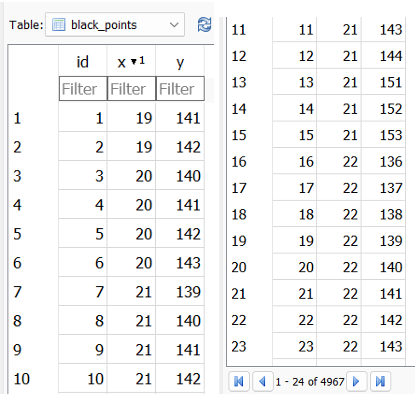

# Project Instructions🧪

## Table of Contents 📋
1. [Overview](#overview)
2. [Problem Statement](#problem-statement)
3. [Solution](#solution)
    - [Step 1: Image Processing](#step-1-image-processing)
    - [Step 2: Clustering Black Pixels](#step-2-clustering-black-pixels)
    - [Step 3: Database Storage](#step-3-database-storage)
    - [Step 4: Visualization](#step-4-visualization)
4. [Result](#result)
5. [Comparison of Distance Function Calls](#comparison-of-distance-function-calls)
6. [Conclusions](#conclusions)

---

## Overview📝
In this laboratory, you will perform clustering of points from the previous lab, considering only the points in neighboring "cells." You will compare the number of distance function calls with traditional clustering approaches.

---

## Problem Statement🔍
- **Task**: Perform clustering of the points from the previous lab, considering only the points in neighboring "cells."
- **Objective**: Compare the number of distance function calls with traditional approaches.

---

## Solution💡
### Step 1: Image Processing🖼️
- The code begins by loading an image and converting it into a numpy data matrix.
- The image is read as a binary matrix, where black pixels are represented by 1 and all other pixels by 0.

### Step 2: Clustering Black Pixels⚫
- A function named `clusterize_cells` is defined to identify and cluster groups of black pixels in the image.
- This clustering approach uses labeling and neighboring cells. For each cluster identified, the total number of distance function calls is calculated.

### Step 3: Database Storage💾
- The coordinates of black points and clusters are stored in an SQLite database.
- Coordinates are saved as pairs (x, y).

### Step 4: Visualization📊
- The original image, black points, and identified clusters are displayed.
- The total number of distance function calls is shown along with a legend for the clusters.

---

## Result📈
- The SQLite database stores the found black points and their coordinates (x, y).

  
   
  <em>Example 1: Database</em>

- A comparison of the number of distance function calls for each approach (neighboring "cells," K-Means, and Single Linkage) is shown in the table below:

| Image | Initial Distance | Neighboring Cells | K-Means | Single Linkage |
|-------|------------------|-------------------|---------|----------------|
| Circles | 15561 | 1524978 | 121064580 |
| Full    | 23394 | 795396  | 273627921 |
| Moons   | 10913 | 283738  | 59541328  |
| Spots   | 4967  | 19868   | -          |
| Stripes | 16092 | 12333061| 128736     |

---

## Comparison of Distance Function Calls📊
### Neighboring Cells Approach
- The total number of distance function calls is calculated by clustering neighboring cells.
- This method involves traversing the image cells and forming clusters by adding neighboring cells that meet specific criteria.
- The number of distance function calls increases as the image size and density grow, requiring more detailed checking and clustering of neighboring cells.

### K-Means Approach
- The total number of distance function calls is calculated in two main steps: cluster assignment and centroid update.
- K-Means assumes initial centroids are chosen, and each point is assigned to the nearest centroid. The centroids' positions are then updated based on the assigned points.
- The number of distance function calls in K-Means is influenced by the number of iterations required to converge to a stable solution and by the number of points and clusters.

### Single Linkage Approach
- The total number of distance function calls is calculated by comparing each point with every other point.
- The Single Linkage algorithm compares the distances between points across all clusters and forms new clusters by connecting the closest points.
- The number of distance function calls increases with image size and density, requiring more comparisons between a larger number of points.
- **Comparison**: Single Linkage uses more distance function calls than K-Means, and K-Means uses more calls than the neighboring cells approach.

---

## Conclusions📝
1. **Neighboring Cells Approach**:
   - The number of distance function calls increases as the image size and density increase due to more detailed checking of neighboring cells.
   
2. **K-Means Approach**:
   - The number of distance function calls is influenced by the number of iterations needed for convergence and the number of points and clusters. K-Means generally requires more function calls than the neighboring cells approach.

3. **Single Linkage Approach**:
   - The number of distance function calls is influenced by the number of point comparisons. Single Linkage requires the most distance function calls due to the need to compare each point with every other point.

---

